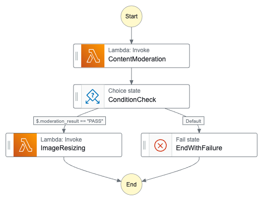

# Content Moderation System API Documentation

## Overview
This system provides an API for end users, enabling them to upload images for content moderation. 
When a user uploads an image, the API triggers a Lambda function (UploadHandler) that handles the image upload, 
creates a record in DynamoDB, and initiates the Step Functions workflow(async).

The Step Functions process the uploaded images to check for objectionable content and perform resizing if necessary. 
The API offers feedback on the upload status only, while moderation and resizing occur asynchronously in the background.
For sync execution, use Express StepFunctions.

To allow users to check the moderation and resizing status, we can provide an additional API endpoint that returns the
current status of the uploaded image, such as `GET /image-status/{image-id}/`.


## URL Request & Response Details
Base URL:
https://xxxxxxx.execute-api.ap-south-1.amazonaws.com/v1

Resource: /upload  
Method: POST  
Payload: <#image>

```
curl --location 'https://xxxxxxx.execute-api.ap-south-1.amazonaws.com/v1/upload' \
--header 'Content-Type: image/png' \
--data '@/Users/gaurav/Desktop/myimage.png'
```

Response Structure:
```
{
  "image_id": "<image-uuid>",
  "image_status": <image_status>,        // Possible values: UPLOADED, UPLOAD_FAILED
}
```

Success Response
```
{
  "image_id": "<image-uuid>",
  "image_status": "UPLOADED",
}
```
Fail Response
```
{
  "image_status": "UPLOAD_FAILED",
  "error": <error message indicating what went wrong>,
}
```


## Moderation & Resizing Flow
UploadHandler lambda trigger the StepFunctions and then StepFunctions follow the below flow.


At different stages, lambda handlers update the DynamoDB records with appropriate image status and moderation result. 


## DynamoDB Table Schema
Table has 4 main attributes(columns) + 2 timestamp attributes

- image_id - PartitionKey
- image_status
- moderation_flags
- moderation_result
- created_at
- updated_at

e.g

| image_id                             | image_status          | moderation_flags         | moderation_result | created_at                       | updated_at                    
|--------------------------------------|-----------------------|--------------------------|-------------------|----------------------------------| ------------------------------
| 77705b8a-33cc-4dc6-8488-af74887ddabf | MODERATED             | Smoking, Drugs & Tobacco | FAIL              | 2024-10-16 15:32:51.090975+00:00 | 2024-10-16 15:32:51.090975+00:00
| 12345abc-33cc-4dc6-8488-af74887ddabf | MODERATED             |                          | PASS              | 2024-10-16 15:32:51.090975+00:00 | 2024-10-16 15:32:51.090975+00:00
| 5678kffs-33cc-4dc6-8488-af74887ddabf | MODERATED_AND_RESIZED |                          | PASS              | 2024-10-16 15:32:51.090975+00:00 | 2024-10-16 15:32:51.090975+00:00